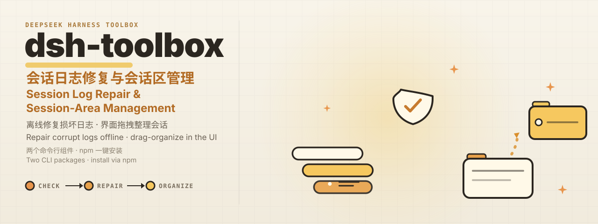

<p align="center"></p>

<p align="center">&nbsp;<a href="https://www.npmjs.com/package/@dsh-toolbox/session-care"></a></p>

<p align="center"><code>DEEPSEEK HARNESS TOOLBOX · SESSION LOG REPAIR &amp; SESSION-AREA MANAGEMENT · MIT</code></p>

<p align="center"></p>

A small toolbox for the DeepSeek Harness with two CLI packages:

> 面向 DeepSeek Harness 的小工具集，两个命令行组件：

- **`dtb-session-care`** — a corrupt session log can keep the whole Harness from starting; health-check and repair logs offline.
    > 会话日志损坏时，Harness 可能打不开 / 无法运行；用它离线体检并修复。
- **`dtb-harness-patch`** — apply the **session-area management patch**: drag sessions between workspaces / ungrouped / archived (all directions), archive folders, cross-directory moves, and resilience so one corrupt log no longer takes the whole UI down.
    > 给 Harness 打上**会话区管理补丁**：界面内拖拽整理会话（工作区 / 未分组 / 归档 之间全向移动）、归档文件夹、跨目录移动，坏日志不再拖垮整个界面。

<p align="center"></p>

```sh
npm i -g @dsh-toolbox/session-care @dsh-toolbox/harness-patch
```

> 推荐通过 npm 全局安装；`@dsh-toolbox/core` 是两个组件的共享底层，无需直接安装。

<p align="center"></p>

```sh
dtb-session-care health              # scan every session log (default root ~/.dsh/sessions)
dtb-session-care repair --apply      # repair corrupt logs (originals kept as .corrupt-<ts>)
dtb-harness-patch                    # apply the full session-area patch (idempotent; re-run after harness upgrades)
```

After `dtb-harness-patch`: **refresh the browser** (client capabilities: drag-organization, archived folder, etc. apply immediately) + **restart the Harness once** (host-side RPCs).

> `dtb-harness-patch` 应用后：**刷新浏览器**（拖拽、归档文件夹等客户端能力立即生效）+ **重启一次 Harness**（host 侧 RPC 生效）。

<p align="center"></p>

| Package | Purpose | Command |
|---|---|---|
| `@dsh-toolbox/session-care` | session-log health check &amp; repair (offline)<br>会话日志健康检查与修复（离线） | `dtb-session-care` |
| `@dsh-toolbox/harness-patch` | session-area management patch (UI capabilities)<br>会话区管理补丁（界面能力） | `dtb-harness-patch` |
| `@dsh-toolbox/core` | shared internals for both — no need to install directly<br>两个组件的共享底层，无需直接安装 | — |

<p align="center"></p>

Clone the repo only for development / contributing — daily use goes through npm.

> 克隆仓库仅供开发与贡献；日常使用请走 npm 安装。

```sh
git clone https://github.com/wxy/dsh-toolbox.git
cd dsh-toolbox
make install        # links the commands into ~/.dsh/tools/bin
```

- [Incident postmortem &amp; repair playbook](docs/playbook-session-corruption.md)
    > [事故复盘与修复手册](docs/playbook-session-corruption.md)

<p align="center"></p>

Released under the [MIT License](LICENSE).

> 本项目以 MIT 许可证发布。

<p align="center"></p>

- npm — [@dsh-toolbox/session-care](https://www.npmjs.com/package/@dsh-toolbox/session-care) · [@dsh-toolbox/harness-patch](https://www.npmjs.com/package/@dsh-toolbox/harness-patch) · [@dsh-toolbox/core](https://www.npmjs.com/package/@dsh-toolbox/core)
    > npm 上的三个软件包
- GitHub — [wxy/dsh-toolbox](https://github.com/wxy/dsh-toolbox)
    > GitHub 仓库
- DeepSeek Harness — [deepseek-ai/dsh](https://github.com/deepseek-ai/dsh)
    > 被修补的 DeepSeek Harness 本体
